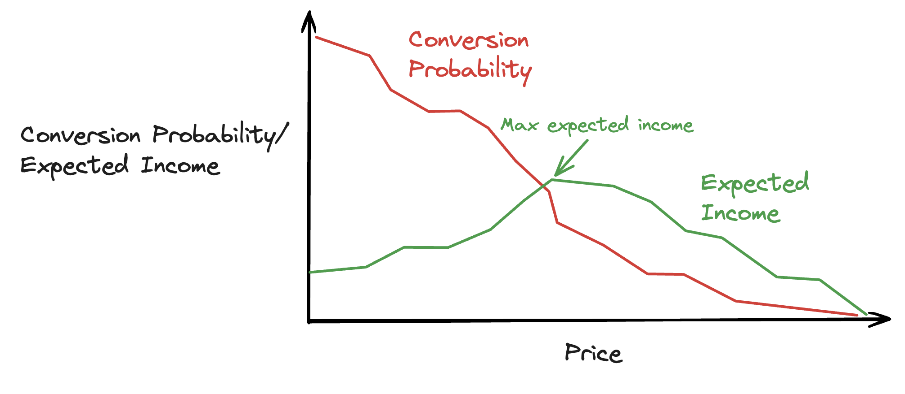

# Data Driven Pricing

## What is data driven pricing?

Data driven pricing is about using data to determine the optimal price points for products and services. Companies using their data to do this correctly have a major advantage over companies that aren't, and we have personally overseen uplifts of 20% margin after deploying such strategies.

## What is the theory behind it?

In most cases when selling a product, a customer has a price range in mind within which they are willing to make a purchase. This price range is often influenced by a customer’s personal preferences, but can also be influenced by external factors such as competitor pricing, seasonal trends and whether the customer is in a hurry to make a purchase.

A key goal in data driven pricing is to identify that price range, usually (but not always) through the development of a machine learning model. When trained correctly, machine learning models are able to use historic data to estimate a probability of conversion at different price points. A suitable price range can be obtained on a number of different levels (customer, product, customer/product group, geographic region) depending on the data available.

Once that price range can be estimated confidently, we can use it to influence pricing. How we influence pricing depends on the objective that the business hopes to achieve. Setting prices near the top of the price range will often result in higher margin, at the cost of reduced conversions, whereas setting prices near the bottom of the range will have the inverse effect. With enough detailed customer data, it is also possible to increase margin and conversion by offering lower prices to customers to price sensitive customers, and higher prices to others.

In the objective is to maximise margin, we can identify the price that returns the highest expected margin, where expected margin = margin * probability_of_conversion. If the goal is to increase market share, we may optimise for total income, which will put more emphasis on achieving a high conversion rate. 

While we hope these examples illustrate the basic idea of data driven pricing, each pricing strategy is often specific to the business in some form, based on the industry, product and availability of data.

